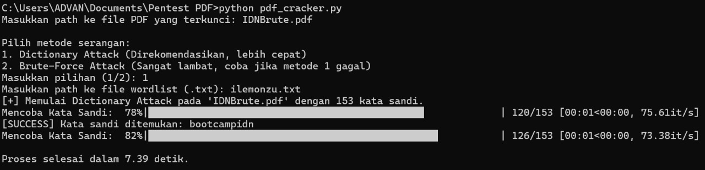

## PDF Password Cracker


Sebuah skrip Python sederhana untuk menemukan kata sandi file PDF yang terproteksi. Dibuat untuk tujuan edukasi dalam memahami cara kerja serangan kamus (*dictionary attack*) dan serangan *brute-force*.

---

### ⚠️ Peringatan Penting

Alat ini dibuat **HANYA untuk tujuan pendidikan** dan untuk digunakan pada file yang Anda miliki secara sah (misalnya, saat Anda lupa kata sandi file PDF Anda sendiri). Menggunakan alat ini pada file milik orang lain tanpa izin adalah tindakan **ilegal dan tidak etis**. Pengembang tidak bertanggung jawab atas segala bentuk penyalahgunaan alat ini.

---

### Demonstrasi

Berikut adalah contoh bagaimana skrip ini berjalan di terminal:




## ✨Fitur
* Dua Metode Serangan:
1. Dictionary Attack: Mencoba kata sandi dari sebuah daftar kata (wordlist). Cepat dan efektif untuk kata sandi umum.
 2. Brute-Force Attack: Mencoba semua kemungkinan kombinasi karakter. Komprehensif namun sangat lambat.
* Antarmuka Interaktif: Dilengkapi antarmuka baris perintah (CLI) yang mudah digunakan.
* Progress Bar: Menampilkan bilah kemajuan (progress bar) menggunakan tqdm agar proses yang panjang dapat dipantau.
* Edukasi: Kode ditulis dengan sederhana dan diberi komentar agar mudah dipahami, dimodifikasi, dan dipelajari.

## 📣Kebutuhan Sistem
* Python 3.7 atau versi yang lebih baru
* pip (Python package installer)

## 🛠️ Instalasi

1. Clone repository ini:
   ```bash
   git clone https://github.com/ILemonzuu/PDF_Cracker.git
   cd pdf_cracker

2. Masuk ke direktori proyek:
   ```bash
   cd NAMA_PROYEK

3. Instal kebutuhan sistem (jika belum terinstal):
   ```bash
   pip install pypdf tqdm

## 📝 Penggunaan
1. Siapkan sebuah file daftar kata (wordlist) dalam format .txt. Anda bisa menggunakan wordlist_contoh.txt atau wordlist_besar_IDN.txt yang ada di proyek ini, atau membuatnya sendiri.

2. Jalankan skrip dari terminal:
   ```bash
   python pdf_cracker.py

3. Ikuti instruksi yang muncul di layar:
* Masukkan path (lokasi) file PDF yang ingin Anda buka.
* Pilih metode serangan (1 atau 2).
* Jika memilih Dictionary Attack, masukkan path ke file wordlist Anda.
* Jika memilih Brute-Force Attack, masukkan panjang maksimum kata sandi yang ingin dicoba.

## 📝 Cara Kerja
* Dictionary Attack: Skrip akan membaca setiap baris dari file wordlist yang Anda berikan. Setiap baris dianggap sebagai satu percobaan kata sandi. Skrip kemudian mencoba mendekripsi file PDF menggunakan kata sandi tersebut. Jika berhasil, program berhenti dan menampilkan kata sandi yang ditemukan.

* Brute-Force Attack: Skrip akan menghasilkan semua kemungkinan kombinasi karakter (secara default: huruf kecil dan angka) dari panjang 1 hingga panjang maksimum yang Anda tentukan. Setiap kombinasi akan dicoba sebagai kata sandi. Metode ini menjamin penemuan kata sandi (jika polanya sesuai), tetapi membutuhkan waktu yang sangat lama.